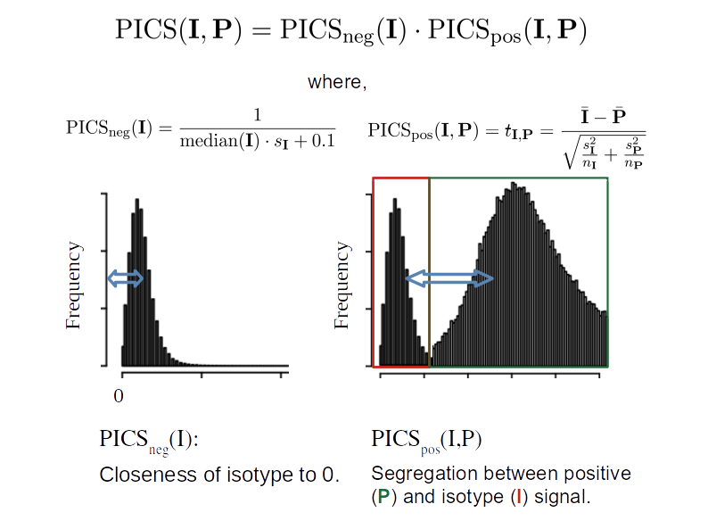

```{r setup, include=FALSE}
knitr::opts_chunk$set(echo = TRUE)
options(bitmapType="cairo") 
```

## Load necessary libraries

```{r}
suppressPackageStartupMessages({
# library(pipeComp)
  library(ggplot2)
  library(SingleCellExperiment)
  library(tidyr)
  library(tidyverse)
  library(gridExtra)
  library(patchwork)
  library(cowplot)
  library(reshape2)
  library(rlist)
  library(fBasics)
  library(plotROC)
  library(ComplexHeatmap)
  library(circlize)
  library(ggrepel)

})
source("../src/pics.R")
source("../src/norm.R")

## Subsample ? Mainly for interactive
if (interactive()) SUBSAMPLING = FALSE else SUBSAMPLING = FALSE
```


The initial PICS score idea: 

```{r pressure, echo=FALSE, fig.cap="A caption", out.width = '100%'}

```


```{r}
## UTILS

do_pics_comb_plot <- function(dat, ks_pos = TRUE, neg_fun = "KS", digits = 0, show_subscore = FALSE){
  # for each dataset
  # iterate over isotype and positive markers
  # calculate the pics score and
  # display it on a score for the different normalization among the markers
  out_ks <- list()
  INDEX=0
  for (i in names(dat)){
    for (j in neg[[i]]){
      for (k in pos[[i]]){
        INDEX = INDEX+1
        
        datsub <- dat[[i]][c(j, k)]
        norm_nam <- assayNames(datsub)
        # global
        pics <- lapply(norm_nam, function(x) round(picsScore(datsub, x, ks_pos = ks_pos, neg_fun = neg_fun), digits))
        names(pics) <- norm_nam
        # positive
        pics_pos <- lapply(norm_nam, function(x) round(picsScore(datsub, x, ks_pos = ks_pos, neg_fun = neg_fun, 
                                                             positive_only = TRUE), digits))
        names(pics_pos) <- norm_nam
        # negative
        pics_neg <- lapply(norm_nam, function(x) round(picsScore(datsub, x, ks_pos = ks_pos, neg_fun = neg_fun, 
                                                             negative_only = TRUE), digits))
        names(pics_neg) <- norm_nam
        
        # sort by score
        norm_nam <- norm_nam[order(unlist(pics))]
        
        # plots
        pos_pl <- lapply(norm_nam, function(x){
          if(x == norm_nam[1]) xnam <- k else xnam <- ""
          df <- data.frame(value = assay(datsub, x)[k,])
          ggplot(df, aes(x=value)) + 
            geom_histogram(fill = "#38761D") + ggtitle(paste0(x, ": PICS=", pics[[x]])) +
                                                              #"\nPICS_pos=", pics_pos[[x]]) ) +
            ylab(xnam) + xlab("")
        })
        neg_pl <- lapply(norm_nam, function(x){
          if(x == norm_nam[1]) xnam <- j else xnam <- ""
          df <- data.frame(value = assay(datsub, x)[j,])
          ggplot(df, aes(x=value)) + 
            geom_histogram(fill = "#990000", alpha = 0.9) + 
            # ggtitle(paste0("\nPICS_neg=", pics_neg[[x]]) )+ 
            ylab(xnam) + xlab("")
        })
        out_ks[[paste(INDEX,i, j, k, sep = ",")]] <- wrap_plots(pos_pl, ncol = 1) -
          wrap_plots(neg_pl, ncol = 1)
  
      }
    }
  }

  return(out_ks)
}
```

## Load data

```{r}
dat <- list.files("../data", full.names = TRUE)
dat <- lapply(dat, function(x) readRDS(paste0(x, "/d.rds")))
names(dat) <- list.files("../data/")
# only take the ADT as main sce
dat <- lapply(dat, function(x) altExp(x))
if(SUBSAMPLING != FALSE){
  dat <- lapply(dat, function(x){
    set.seed(1234)
    x[ ,sample(ncol(x), SUBSAMPLING)]
  })
}
dat
```


```{r}
# keeping only hao & kotliarov, whcih have isotypes
dat <- dat[c(grep("antunes|hao|kotliarov", names(dat)))]

```

```{r}
nam <- grep("kotliarov", names(dat))
dat[[nam]]$phenoid[dat[[nam]]$phenoid == "C0"] <- "CD4+ naive T"
dat[[nam]]$phenoid[dat[[nam]]$phenoid == "C1"] <- "CD4+ memory"
dat[[nam]]$phenoid[dat[[nam]]$phenoid == "C2"] <- "monocytes and mDC"
dat[[nam]]$phenoid[dat[[nam]]$phenoid == "C3"] <- "B cells"
dat[[nam]]$phenoid[dat[[nam]]$phenoid == "C4"] <- "CD8+"
dat[[nam]]$phenoid[dat[[nam]]$phenoid == "C5"] <- "NK"
dat[[nam]]$phenoid[dat[[nam]]$phenoid == "C6"] <- "CD8+ naive T"
dat[[nam]]$phenoid[dat[[nam]]$phenoid == "C7"] <- "unconventional T"
dat[[nam]]$phenoid[dat[[nam]]$phenoid == "C8"] <- "non-classical monocytes"
dat[[nam]]$phenoid[dat[[nam]]$phenoid == "C9"] <- "pDC"
```

Datasets with both isotypes and positive controls, used in this report: 

```{r}
tabledat <- data.frame(
  # "Dataset" = names(dat), 
  "N cells" = unlist(lapply(dat, ncol)), 
  "N ADTs" = unlist(lapply(dat, nrow)),
  "N isotypes" = unlist(lapply(dat, function(x) sum(rowData(x)$is.isotype))), 
  "N positives" = unlist(lapply(dat, function(x) sum(rowData(x)$is.posControl))), 
  "N cell types lvl 0" = unlist(lapply(dat, function(x) length(unique(x$phenoid)))), 
  "N cell types lvl 1" = unlist(lapply(dat, function(x) length(unique(x$phenoid2)))), 
  "N cell types lvl 2" = unlist(lapply(dat, function(x) length(unique(x$phenoid3)))) 
)
knitr::kable(t(tabledat))
```
Unifying names: 

```{r}


lapply(dat, function(x) rownames(x)[rowData(x)$is.isotype]) 
rownames(dat[["kotliarov_2020"]])[rownames(dat[["kotliarov_2020"]]) == "MouseIgG2akappaisotype"] <- "IgG2a_Mouse_k"
rownames(dat[["kotliarov_2020"]])[rownames(dat[["kotliarov_2020"]]) == "RatIgG2bkIsotype"] <- "IgG2b_Rat_k"
rownames(dat[["hao_2020"]])[rownames(dat[["hao_2020"]]) == "Rat_IgG2b"] <- "IgG2b_Rat_k"
rownames(dat[["hao_2020"]])[rownames(dat[["hao_2020"]]) ==  "Rag_IgG2c" ] <- "IgG2c_Rat_k"
```


Positive and negative markers in each dataset, as defined by the authors of the studies: 

```{r}
print("ISOTYPES--------------------:")
(neg <- lapply(dat, function(x){
  rownames(rowData(x)[rowData(x)$is.isotype == TRUE, ])
}))


print("POSITIVE CONTROLS:--------------------")
(pos <- lapply(dat, function(x){
  rownames(rowData(x)[rowData(x)$is.posControl == TRUE, ])
}))


```

Antibody metadata

```{r, warning=FALSE, message=FALSE}
abs_kot <- read_csv("../data/kotliarov_2020/abs_metadata.csv")
abs_hao <- read_csv("../data/hao_2020/abs_metadata.csv")
abs_antunes_hdc <- read_csv("../data/antunes_2021_human_DC/abs_metadata.csv")
abs_antunes_htam <- read_csv("../data/antunes_2021_human_TAM/abs_metadata.csv")
abs_antunes_mtam <- read_csv("../data/antunes_2021_mouse_TAM/abs_metadata.csv")


abs_kot <- data.frame("antibody.clone" = abs_kot$Clone, 
                      "target" = abs_kot$Specificity, 
                      "dataset" = "Kotliarov")
abs_hao <- data.frame("antibody.clone" = abs_hao$`Antibody Clone`, 
                      "target" = abs_hao$Target, 
                      "dataset" = "Hao")
abs_antunes_hdc <- data.frame("antibody.clone" = abs_antunes_hdc$Clone, 
                      "target" = abs_antunes_hdc$Name, 
                      "dataset" = "Antunes_human_DC")
abs_antunes_htam <- data.frame("antibody.clone" = abs_antunes_htam$Clone, 
                      "target" = abs_antunes_htam$Name, 
                      "dataset" = "Antunes_human_TAM")
abs_antunes_mtam <- data.frame("antibody.clone" = abs_antunes_mtam$Clone, 
                      "target" = abs_antunes_mtam$Name, 
                      "dataset" = "Antunes_mouse_TAM")

abs_metadata <- rbind(abs_kot, abs_hao, abs_antunes_hdc, abs_antunes_htam, abs_antunes_mtam)
head(abs_metadata)
```

## Preprocessing

Normalization methods used: 

- log normalized counts (`logNormCounts`)

- centered-log ratio (CLR) ADT-wise

- centered-log ratio (CLR) cell-wise

```{r, warning=FALSE, message=FALSE}
dat <- lapply(dat, function(x){
  x <- logNormCounts(x)
  logcounts(x) <- assay(x, "logNormCounts")
  x <- clr.seurat_adts(x)
  x <- clr.seurat_cells(x)
  assay(x, "logNormCounts") <- NULL
  x
})
dat
```


<!-- ================================================ -->
<!-- ================================================ -->
<!-- ================================================ -->


## PICS score

PICS score calculation on different combinations of positive/ negative markers: 


### KS test for positive and negative components {.tabset}


We have here both the positive and the negative component with KS test


```{r warning=FALSE, message=FALSE}
out <- do_pics_comb_plot(dat, ks_pos = TRUE, neg_fun = "KS", digits = 2)
```


```{r, results='asis', echo = FALSE, warning=FALSE, message=FALSE, eval=!interactive()}
for (i in 1:length(out)) {
  cat("#### ",names(out)[i],"\n")
  print(out[[i]])
  cat('\n\n')
}
```


## ROC curve {.tabset}

Use somehow ROC and AUC score to define separation ?

```{r}

pos_temp <- assay(dat[["hao_2020"]], "clr_cells")["CD45RA", ]
neg_temp <- assay(dat[["hao_2020"]], "clr_cells")["IgG2c_Rat_k", ]
labels <- c(rep(0, length(neg_temp)), rep(1, length(pos_temp)))
datroc <- data.frame(exprs = c(neg_temp, pos_temp), 
                     status = labels)

basicplot <- ggplot(datroc, aes(d = status, m = exprs)) + geom_roc()+ style_roc() + ggtitle("Example ROC curve \nCD45RA vs Rat-IgG1" )
   
basicplot + annotate("text", x = .75, y = .25, 
           label = paste("AUC =", round(calc_auc(basicplot)$AUC, 2))) + 
  ggplot(datroc[datroc$status == 0, ], aes(x=exprs)) + 
            geom_histogram(data=subset(datroc, status == 1), fill = "#38761D", alpha = 0.5)  +
            geom_histogram(data=subset(datroc, status == 0), fill = "#990000", alpha = 0.5) +
            ylab("freq") + xlab("clr_cells") + 
  ggtitle("CD45RA vs Rat-IgG1 expression")
```

```{r, message=FALSE,echo=FALSE, warning=FALSE}
## ROC curves and AUC scores for all combinations of dataset, normalization, positive and negative

INDEX = 0
out_roc <- list()
out_auc <- data.frame(matrix(ncol = 8, nrow = 0))
x <- c("AUC", "PICS.ks", "PICS.ks.pos", "PICS.ks.neg", "normalization", 
       "positive.marker", "negative.marker", "DS")
colnames(out_auc) <- x


for (i in names(dat)){
  for (j in neg[[i]]){
    for (k in pos[[i]]){
      datsub <- dat[[i]][c(j, k)]
      norm_nam <- assayNames(datsub)
      for (l in norm_nam){
              INDEX = INDEX + 1
              
              ## extract neg and positive expr and format in table
              pos_i <- assay(datsub, l)[k, ]
              neg_i <- assay(datsub, l)[j, ]
              labels <- c(rep(0, length(neg_i)), rep(1, length(pos_i)))
              datroc <- data.frame(exprs = c(neg_i, pos_i), 
                     status = labels)
              
              ## calculate PICS scores with 3 variants
              ## neg_fun = "KS", "med_sd" or "KS_sd"
              PICS.ks.pos <- round(picsScore(datsub, l, ks_pos = TRUE, neg_fun = "KS", positive_only = TRUE), 3)
              PICS.ks.neg <- round(picsScore(datsub, l, ks_pos = TRUE, neg_fun = "KS", negative_only = TRUE), 3)
              PICS.ks.glob <- round(picsScore(datsub, l, ks_pos = TRUE, neg_fun = "KS"), 3)
              # PICS.med_sd.pos <- round(picsScore(datsub, l, ks_pos = TRUE, 
              #                                    neg_fun = "med_sd", positive_only = TRUE), 3)
              # PICS.med_sd.neg <- round(picsScore(datsub, l, ks_pos = TRUE, 
              #                                    neg_fun = "med_sd", negative_only = TRUE), 3)
              # PICS.med_sd.glob <- round(picsScore(datsub, l, ks_pos = TRUE, 
              #                                     neg_fun = "med_sd"), 3)
              # PICS.KS_sd.pos <- round(picsScore(datsub, l, ks_pos = TRUE, 
              #                                   neg_fun = "KS_sd", positive_only = TRUE), 3)
              # PICS.KS_sd.neg <- round(picsScore(datsub, l, ks_pos = TRUE, 
              #                                   neg_fun = "KS_sd", negative_only = TRUE), 3)
              # PICS.KS_sd.glob <- round(picsScore(datsub, l, ks_pos = TRUE, 
              #                                    neg_fun = "KS_sd"), 3)
              
              ## plot roc and extract auc score from it
              rocplot <-  ggplot(datroc, aes(d = status, m = exprs)) + geom_roc()+ style_roc() + 
                ggtitle(paste0("ROC curve - ", k, " vs ", j, " \n",i, " dataset" ))
              auc_temp <- round(calc_auc(rocplot)$AUC, 2)
              
              ## store plot + hist
              out_roc[[INDEX]] <- rocplot + annotate("text", x = .75, y = .25, 
           label = paste("AUC =", round(calc_auc(rocplot)$AUC, 2)))  +
                ggplot(datroc[datroc$status == 0, ], aes(x=exprs)) + 
                geom_histogram(data=subset(datroc, status == 1), fill = "#38761D", alpha = 0.5)  +
                geom_histogram(data=subset(datroc, status == 0), fill = "#990000", alpha = 0.5) +
                ylab("freq") + xlab(l) 
                
              ## stores roc score and metadata in table for this iter
              out_auc <- rbind(out_auc, 
                                      data.frame(AUC = auc_temp, 
                                                 PICS.ks.glob = PICS.ks.glob, 
                                                 PICS.ks.pos = PICS.ks.pos, 
                                                 PICS.ks.neg = PICS.ks.neg,
                                                 # PICS.med_sd.pos = PICS.med_sd.pos, 
                                                 # PICS.med_sd.neg = PICS.med_sd.neg, 
                                                 # PICS.med_sd.glob = PICS.med_sd.glob, 
                                                 # PICS.KS_sd.pos = PICS.KS_sd.pos, 
                                                 # PICS.KS_sd.neg = PICS.KS_sd.neg, 
                                                 # PICS.KS_sd.glob = PICS.KS_sd.glob, 
                                                 normalization = l, 
                                                 positive.marker = k, 
                                                 negative.marker = j, 
                                                 ds = i ) )
      }
    }
  }
}

## pairs of markers
out_auc$pair <- paste( out_auc$positive.marker, out_auc$negative.marker, out_auc$ds)

```


```{r, results='asis', echo = FALSE,warning=FALSE, message=FALSE,eval=!interactive()}
for (i in 1:length(out_roc)) {
  cat("### ",names(out_roc)[i],"\n")
  print(out_roc[[i]])
  cat('\n\n')
}
```


## AUC Summary plots

```{r, fig.height=5, fig.width=8}

# Assuming your dataframe is named 'df' with numerical column 'num_col' and categorical column 'cat_col'
ggplot(out_auc, aes(x = normalization, y = AUC, color = normalization)) +
  geom_violin() + ggtitle("Effect of **normalization method** on AUC") 
```


Are top scores in one method also top for other methods ? 

```{r}

ggplot(out_auc, aes(x = normalization, y = AUC, color = normalization)) +
  geom_violin() + ggtitle("Effect of **normalization method** on AUC") + 
  geom_line(aes(group=pair))

```

AUC difference among positive markers

```{r, fig.height=5, fig.width=8}

# Assuming your dataframe is named 'df' with numerical column 'num_col' and categorical column 'cat_col'
ggplot(out_auc, aes(x = positive.marker, y = AUC, color = positive.marker)) +
  geom_violin() + 
  # ggtitle("AUC difference among isotype")  +
  xlab("Positive markers") + 
  theme(axis.text.x = element_text(angle = 45, vjust = 1, hjust = 1)) + 
  theme(legend.position="none")
  
```

AUC among isotypes

```{r, fig.height=5, fig.width=8}

# Assuming your dataframe is named 'df' with numerical column 'num_col' and categorical column 'cat_col'
ggplot(out_auc, aes(x = negative.marker, y = AUC, color = negative.marker)) +
  geom_violin() +
  # ggtitle("AUC difference among isotype")  + 
  theme(axis.text.x = element_text(angle = 45, vjust = 1, hjust = 1))  + 
  theme(legend.position="none")
```

AUC difference among dataset
```{r, fig.height=5, fig.width=8}

# Assuming your dataframe is named 'df' with numerical column 'num_col' and categorical column 'cat_col'
ggplot(out_auc, aes(x = ds, y = AUC, color = ds)) +
  geom_violin() +
  # ggtitle("AUC difference among dataset") + 
  theme(axis.text.x = element_text(angle = 45, vjust = 1, hjust = 1)) + 
  theme(legend.position="none")
```

Best AUC scores: 

```{r}
a <- head(out_auc[order(out_auc$AUC, decreasing = TRUE), ], 20) 
  knitr::kable((a))
  
```


### AUC vs PICS (using KS components) 

**Rational**: a better correlation between AUC and PICS might imply that PICS is a good replacement for what AUC measures: a good separation between positive and negative peaks. However, while AUC needs the information about isotype, PICS does not. 


```{r, fig.height=5, fig.width=12}

ggplot(out_auc, aes(x=AUC, y=PICS.ks.glob, col = normalization)) + 
geom_point() + 
  # geom_smooth(se = FALSE) +
  ggtitle("AUC vs PICS score") + 
  xlab("AUC") + ylab("PICS global (ks)") +
ggplot(out_auc, aes(x=AUC, y=PICS.ks.pos, col = normalization)) + 
geom_point() + 
  # geom_smooth(se = FALSE) + 
  xlab("AUC") + ylab("PICS positive (ks)") +
ggplot(out_auc, aes(x=AUC, y=PICS.ks.neg, col = normalization)) + 
geom_point() + 
  # geom_smooth(se = FALSE) + 
  xlab("AUC") + ylab("PICS negative (ks)")

```


==> See in which case PICS > AUC and the opposite ? Integrate this into parameters..? 

```{r}
melt_auc <- out_auc[,c("AUC", grep("PICS", colnames(out_auc), value = T), "normalization")]
melt_auc = melt(melt_auc, id.vars = c("AUC", "normalization"),
                measure.vars = c(grep("PICS", colnames(melt_auc), value = T)), 
                value.name = "PICS.score")
# Define a regular expression pattern to match "X.Y.Z" format
pattern <- "^[^.]+\\.([^\\.]+)\\.[^.]+$"
# Use gsub with the pattern to extract the middle part ("Y")
melt_auc$negative_score <- gsub(pattern, "\\1", melt_auc$variable)
pattern <- "^[^.]+\\.[^.]+\\.([^\\.]+)$"
# Use gsub with the pattern to extract the last part ("Z")
melt_auc$score_component <-  gsub(pattern, "\\1", melt_auc$variable)

ggplot(melt_auc, aes(AUC, PICS.score, colour = factor(normalization))) + geom_point() + 
  facet_grid(rows = vars(score_component), cols = vars(negative_score),  
             scales = "free_y")+ labs(color='Normalization') 
```

```{r}
# Calculate correlation between X and Y for all combinations of A and B
corr_auc.pics <- melt_auc %>%
  group_by(negative_score, normalization) %>%
  summarise(correlation = cor(AUC, PICS.score, method = "spearman"), .groups = "drop")

avg_values <- corr_auc.pics %>%
  group_by(negative_score) %>%
  summarise(avg_B = mean(correlation))

# Reorder levels of A based on average values of B
corr_auc.pics$negative_score <- factor(corr_auc.pics$negative_score, 
                                       levels = avg_values$negative_score[order(avg_values$avg_B)])

ggplot(corr_auc.pics, aes(negative_score, correlation, colour = factor(normalization)) ) + 
  geom_point(size = 3) + xlab("negative score\nstrategy") + labs(color='Normalization') 

```


```{r}
# Calculate correlation between X and Y for all combinations of A and B
corr_auc.pics <- melt_auc %>%
  group_by(negative_score, score_component) %>%
  summarise(correlation = cor(AUC, PICS.score, method = "spearman"), .groups = "drop") 

avg_values <- corr_auc.pics %>%
  group_by(negative_score) %>%
  summarise(avg_B = mean(correlation))

# Reorder levels of A based on average values of B
corr_auc.pics$negative_score <- factor(corr_auc.pics$negative_score, 
                                       levels = avg_values$negative_score[order(avg_values$avg_B)])

ggplot(corr_auc.pics, aes(negative_score, correlation, colour = factor(score_component)) ) + 
  geom_point(size = 3) + xlab("negative score\nstrategy") + labs(color='PICS score\ncomponent') 

```


## AUC vs Isotypes / negatives 

AUC scores for positive vs negative markers: 

SUPPLEMENTARY FIGURE 

```{r, fig.height=5, fig.width=8}

library(viridis)
ggplot(out_auc, aes(positive.marker, negative.marker, fill = AUC)) + 
  geom_tile() + scale_fill_viridis() + xlab("Positive markers") + ylab("Isotypes") + 
  theme(axis.text.x = element_text(angle = 45, vjust = 1, hjust = 1)) 

```


```{r, fig.height=5, fig.width=10}

ggplot(out_auc[out_auc$ds == "hao_2020", ], aes(positive.marker, negative.marker, fill = AUC)) + 
  geom_tile() + scale_fill_viridis() + xlab("Positive markers") + ylab("Negative markers") +
  ggtitle("Hao dataset") + 
  theme(axis.text.x = element_text(angle = 45, vjust = 1, hjust = 1)) + 
ggplot(out_auc[out_auc$ds == "kotliarov_2020", ], aes(positive.marker, negative.marker, fill = AUC)) + 
  geom_tile() + scale_fill_viridis() + xlab("Positive markers") + ylab("Negative markers") +
  ggtitle("Kotliarov dataset")+ 
  theme(axis.text.x = element_text(angle = 45, vjust = 1, hjust = 1))

```


```{r}
print("isotypes:")
(neg <- lapply(dat, function(x){
  rownames(rowData(x)[rowData(x)$is.isotype == TRUE, ])
}))


print("positive controls:")
(pos <- lapply(dat, function(x){
  rownames(rowData(x)[rowData(x)$is.posControl == TRUE, ])
}))
```

Not all isotypes/ positive controls can be retrieves in the metadata ... 

For instance, no isotypes could be retrieved among the Hao metadata

```{r}

abs_metadata$target[abs_metadata$target == "Mouse IgG1, κ isotype Ctrl"] <- "MouseIgG1kappaisotype" 
abs_metadata$target[abs_metadata$target == "Mouse IgG2a, κ isotype Ctrl"] <- "MouseIgG2akappaisotype"
abs_metadata$target[abs_metadata$target == "Mouse IgG2b, κ Isotype Ctrl"] <- "Mouse IgG2bkIsotype"
abs_metadata$target[abs_metadata$target == "Rat IgG2b, κ Isotype Ctrl"] <- "Rat-IgG2b"
abs_metadata$target[abs_metadata$target == "IgG1"] <- "MouseIgG1kappaisotype"
abs_metadata$target[abs_metadata$target == "IgG1"] <- "MouseIgG2akappaisotype"


abs_sub <- abs_metadata[abs_metadata$target %in% c(out_auc$positive.marker, out_auc$negative.marker), ]
abs_sub[order(abs_sub$target), ]

```


```{r}
abs_hao
```


```{r}
sessionInfo()
```


